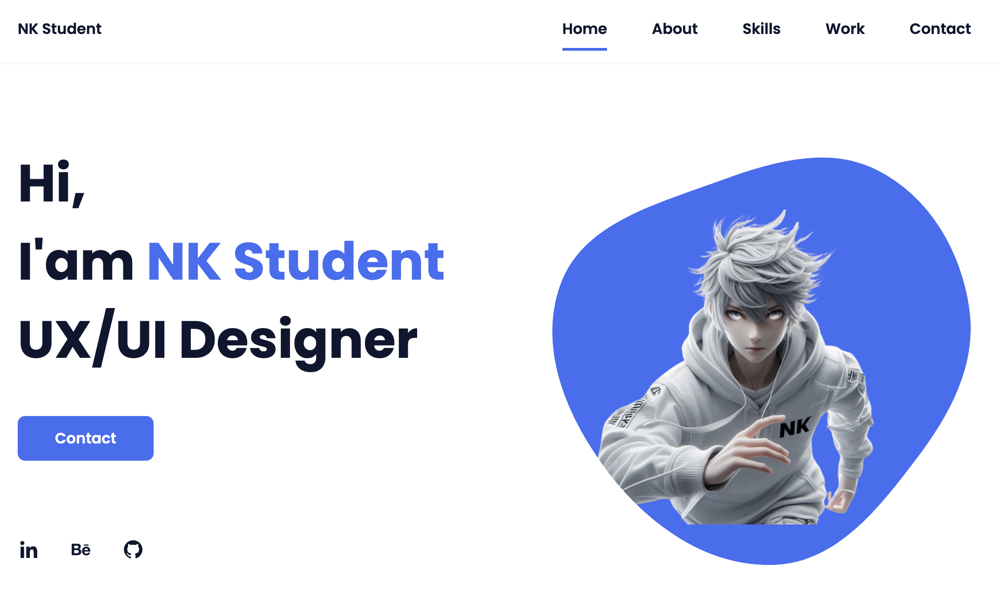

# UX/UI Student-Designer Portfolio 2024

Welcome to the UX/UI Student-Designer Portfolio repository. This project showcases a personal portfolio website for Student, a UX/UI designer. The site includes sections for home, about, skills, work, and contact.



## Table of Contents

- [Demo](#demo)
- [Features](#features)
- [Technologies Used](#technologies-used)
- [Installation](#installation)
- [Usage](#usage)
- [Contributing](#contributing)
- [License](#license)

## Demo

You can view the live demo of the portfolio [here](https://my-student-portfolio.tiiny.site/index.html).

## Features

- **Responsive Design:** The layout adapts to different screen sizes and devices.
- **Home Section:** Introduction with links to social profiles.
- **About Section:** Information about Student’s background and approach.
- **Skills Section:** Display of technical and design skills with progress indicators.
- **Work Section:** Gallery of previous projects.
- **Contact Section:** Form for visitors to get in touch.

## Technologies Used

- **HTML5**
- **CSS3**
- **JavaScript**
- **[Boxicons](https://boxicons.com/)** for icons
- **[ScrollReveal](https://scrollrevealjs.org/)** for scroll animations

## Installation

To run this project locally:

1. **Clone the repository:**
   ```bash
   git clone https://github.com/your-username/portfolio.git
   ```
   
2. **Navigate to the project directory:**
   ```bash
   cd portfolio
   ```

3. **Open `index.html` in your browser:**
   ```bash
   open index.html
   ```
   Or, simply double-click `index.html`.

## Usage

- **Navigation:** Click on the navigation links to jump to different sections of the portfolio.
- **Contact Form:** Fill out the contact form to send a message (Note: Actual form submission functionality needs to be connected to a backend service).
- **Social Links:** Click on social media icons to visit Student’s profiles.

## Contributing

Contributions are welcome! Here's how you can help:

1. Fork the repository.
2. Create a new branch (`git checkout -b feature-branch`).
3. Make your changes and commit (`git commit -m 'Add new feature'`).
4. Push to the branch (`git push origin feature-branch`).
5. Open a pull request.

## Acknowledgements

This portfolio project draws significant inspiration and structural foundation from the work of Bedimcode. The original repository, [Bedimcode's Portfolio-Responsive-Complete](https://github.com/bedimcode/portfolio-responsive-complete), provided an excellent starting point for the layout, design patterns, and responsiveness features implemented in this portfolio.

Special thanks to:

- **[Bedimcode](https://github.com/bedimcode)**: For the comprehensive and well-documented codebase that served as a guide in developing this project. Your contribution to the community is greatly appreciated.

- **Open Source Community**: For fostering an environment of collaboration and sharing that allows developers to build on and improve each other's work.

The modifications and enhancements in this project include personalized content, unique styling, and additional features tailored to fit Student’s UX/UI design portfolio. While the base design and layout closely follow the original, all customizations and content changes reflect Student's individual style and professional presentation.

Please visit Bedimcode's [original repository](https://github.com/bedimcode/portfolio-responsive-complete) to explore their fantastic work and other projects.

## License

This project is licensed under the MIT License. See the [LICENSE](LICENSE) file for details.

---

Feel free to reach out for any inquiries or suggestions at [wannawongworachataj@gmail.com](mailto:wannawongworachataj@gmail.com).

---

**Student** | UX/UI Designer | [LinkedIn](https://www.linkedin.com/in/brainwaves-your-ai-playground-9082922ba) | [GitHub](https://github.com/worachat-dev)

```

### Notes:

1. **Screenshots:**
   - Include a screenshot of your portfolio website by replacing `assets/img/portfolio-screenshot.png` with the actual path to your screenshot.

2. **Links:**
   - Replace `https://your-live-demo-link.com` with the URL to your live demo.
   - Replace `your-username` with your GitHub username.
   - Update `your-email@example.com` with your contact email.
   - Update social media links with actual URLs.

3. **Badges:**
   - The badges at the bottom are placeholders; you can use shields.io to generate the correct badge URLs for your GitHub repository. Replace `your-username` and `portfolio` with your actual GitHub username and repository name.

This `README.md` provides a comprehensive overview of your portfolio project, making it easier for others to understand and contribute.


